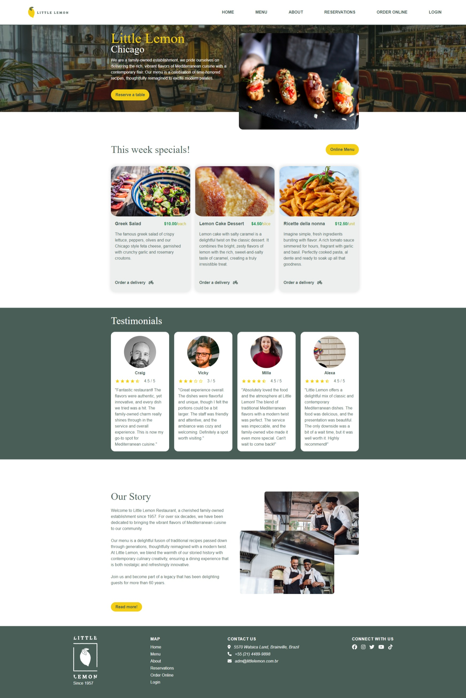
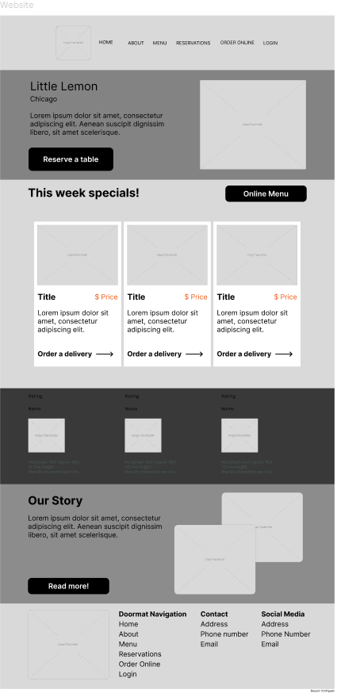
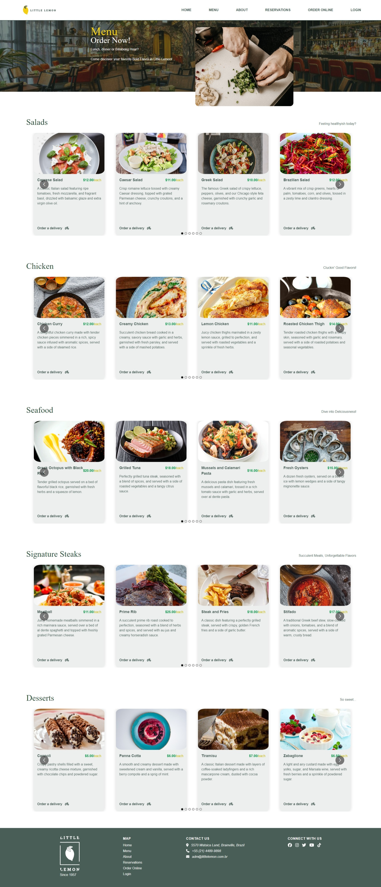
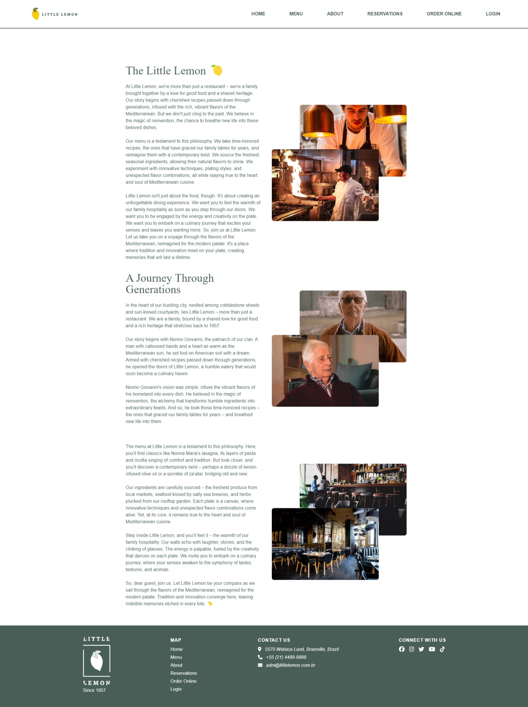
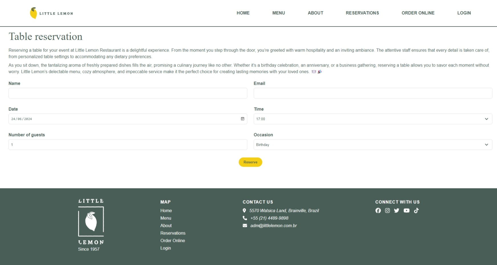

## Meta Front-End Developer Capstone Project

# Little-Lemon 🍋

Welcome to the Little Lemon Restaurant website repository. This project was created as a part of the Meta Frontend Developer course. It's built using React and offers a stylish interface for users who want to explore the restaurant's menu and make reservations.

### Live Demo

[Live Demo Link](https://rodriguessdeyson.github.io/little-lemon)

## Project Road

- [Wireframe](#wireframe)
- [Screenshots](#screenshots)
- [Technologies](#technologies)
- [Installation](#installation)

### Wireframe

### Screenshots

Show Screenshots

### Home

### Menu

### About

### Reservation

### Technologies

- ReactJS

---

### Installation

- Clone the repository
- Run `npm install`
- Run `npm start`